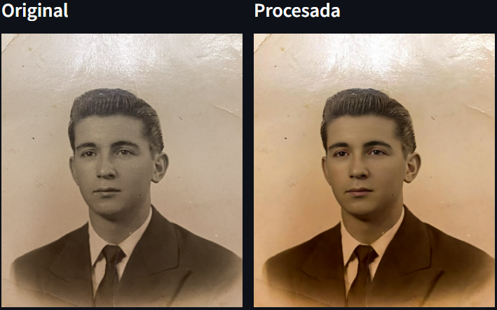
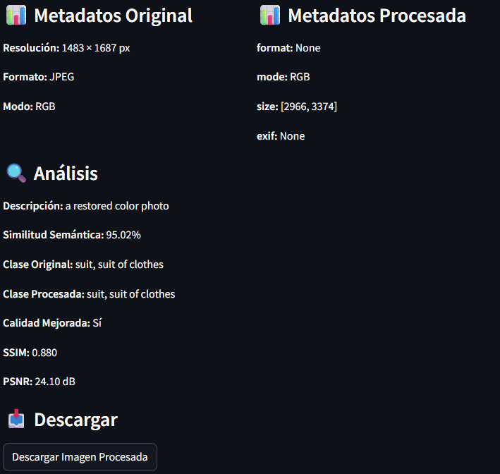
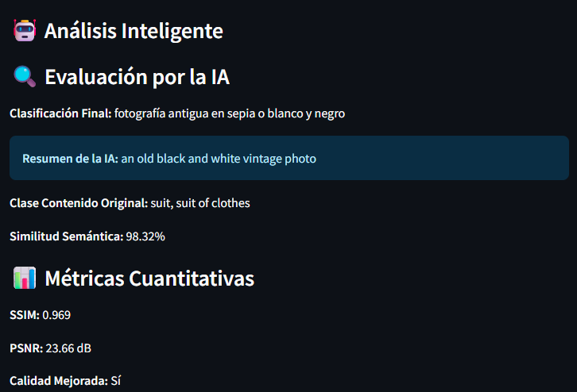
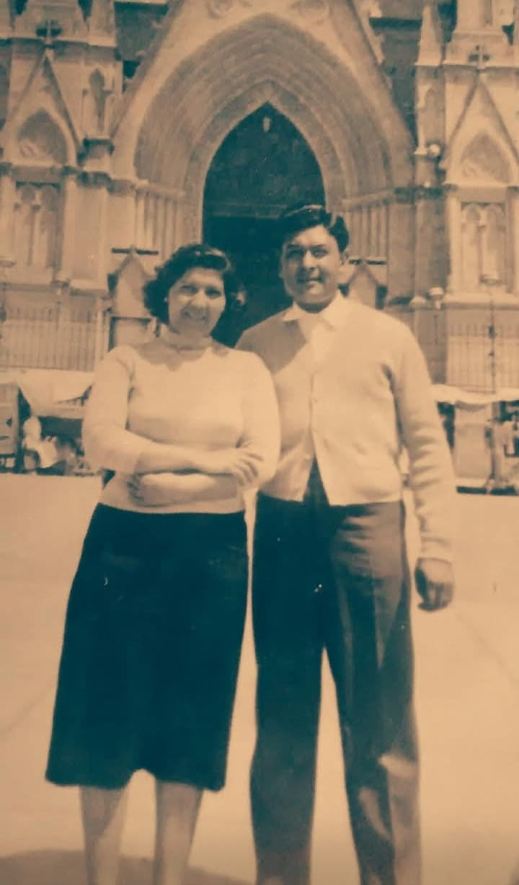

# 📊 Informe de Resultados y Limitaciones Técnicas

> Este documento detalla los resultados obtenidos mediante el pipeline de restauración (SwinIR + GFPGAN + DeOldify) y analiza las limitaciones de infraestructura encontradas durante el desarrollo.

---

## 1. Casos de Éxito: Comparativa Visual

A continuación se presentan los resultados del procesamiento. Se observa la recuperación de nitidez en rostros y la interpretación de color realizada por la IA.

### Caso 1: Retrato Masculino (Restauración Facial)
Este caso demuestra la capacidad del modelo **GFPGAN** para reconstruir rasgos faciales perdidos y la colorización suave de **DeOldify**.

| Original (Dañada/Sepia) | Procesada (Restaurada/Color) |
| :---: | :---: |
|  |  |
 |

**🔍 Análisis Inteligente (IA):**
* **Clasificación de Calidad (CLIP):** *[Ej: Fotografía profesional con buen detalle]*
* **Clase de Contenido (ViT):** *[Ej: Suit / Portrait]*
* **Mejoras Observadas:** Eliminación de ruido en el fondo y recuperación de la textura del cabello.

---

### Caso 2: Foto Grupal / Cuerpo Completo
Prueba de consistencia en la colorización de vestimenta y detección de múltiples rostros.

| Original | Procesada |
| :---: | :---: |
|  |  |

**📊 Métricas Cuantitativas:**
* **SSIM:** *0.969* (Similitud estructural alta)
* **PSNR:** *23.66dB*

---

## 2. Desafíos y Limitaciones Técnicas

Durante el desarrollo del MVP, se identificaron barreras técnicas relacionadas con el uso de APIs externas y modelos generativos.

### 🛑 1. Limitaciones de Infraestructura (API de Replicate)
El desafío más significativo fue la gestión de cuotas y límites de velocidad.
* **Error 429 (Rate Limiting):** La API impone un límite estricto (aprox. 6 peticiones/minuto en capa gratuita). Al encadenar 3 modelos (SwinIR → GFPGAN → DeOldify), el sistema frecuentemente se bloqueaba antes de completar el ciclo.
* **Error 402 (Insufficient Credit):** Los modelos de alta calidad requieren saldo. Esto interrumpió las pruebas de colorización en varias iteraciones, obligando a depender de ejecuciones esporádicas exitosas.

### ⚠️ 2. Artefactos Visuales (Blending)
* **El "Efecto Parche":** En algunas imágenes con iluminación compleja, GFPGAN genera un recuadro visible alrededor de la cara. Esto ocurre porque la cara restaurada tiene una resolución y limpieza muy superior al resto de la imagen original.
* **Solución propuesta:** Implementar un *blending* (mezcla) más agresivo en los bordes de la máscara facial o aplicar un paso de *denoising* más fuerte al fondo para igualar calidades.

### 📉 3. Interpretación de Color
* **Sesgo Sepia:** En imágenes muy amarillentas, DeOldify a veces interpreta el sepia como "color real" y no satura lo suficiente.
* **Solución aplicada:** Se implementó una conversión forzada a Blanco y Negro (`.convert("L")`) al inicio del pipeline y un "Booster" de saturación final (`ImageEnhance.Color`) para mitigar este efecto.

---

## 3. Conclusión del Experimento

A pesar de las limitaciones de la API, el sistema demostró ser capaz de:
1.  **Automatizar** un flujo de trabajo que manualmente tomaría horas.
2.  **Integrar** exitosamente visión por computadora (CLIP) para "entender" la imagen resultante.
3.  **Validar** que la arquitectura híbrida (Streamlit Local + IA en Nube) es viable para un MVP, aunque requiere una infraestructura de pago para producción estable.